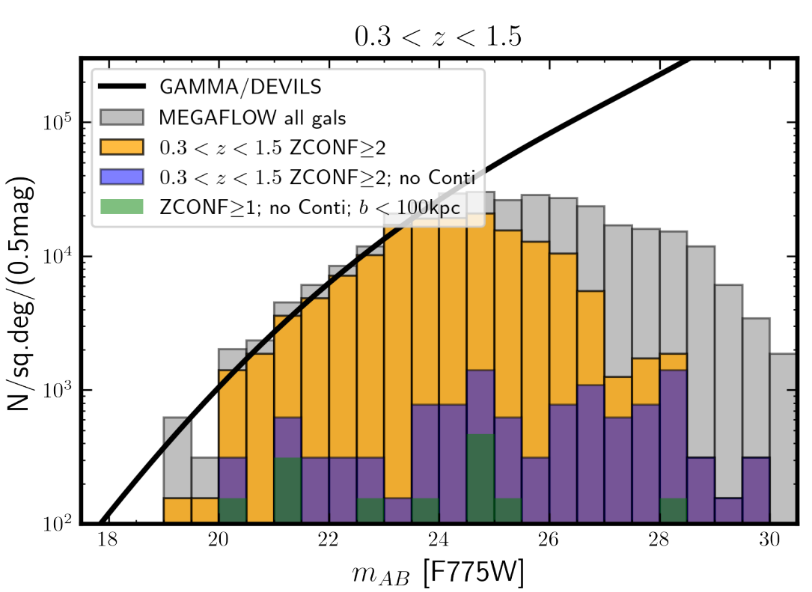
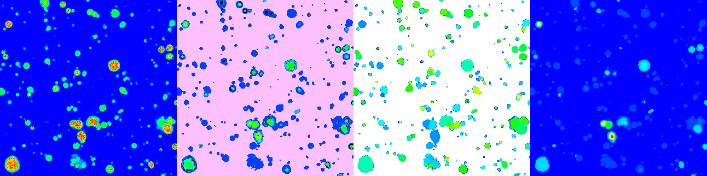

FELINE
======
The FELINE (Find Emission LINEs) algorithm then evaluates the likelihood in
each spectrum of the 3D data cube for emission lines at 
the positions provided by a given redshift and a certain
combination of typical emission features.

FELINE does not evaluate the observed data cube directly, but instead 
utilizes the result of an emission line matched filter to boost the signal-to-noise
of any such feature in the data cube. We use `LSDcat <https://ascl.net/1612.002>`_ to create such a filtered
data cube.
FELINE, however, does not pick individual peaks from that data as separate objects but instead
simulatenously assesses the accumulative signal at all spectral positions that correspond to a certain
set of emission lines at any redshift within the range of interest.

FELINE probes all possible combinations of up to
14 transitions paired in 9 groups:
:math:`\rm{H}\alpha, \rm{H}\beta, \rm{H}\gamma, \rm{H}\delta, \rm{[O II]}, \rm{[O III]}, \rm{[N III]}, \rm{[S II]}  \text{ and } \rm{[Ne III]}` for the
full redshift range of interest (e.g., :math:`0.4 < z < 1.4`).
This particular selection of lines is motivated by the most prominent
emission features expected in the MUSE data within the
redshift range of :math:`\rm{[O II]}` emitters.
This results in 512 :math:`(2^9)` different models that
are assessed at roughly 8,000 different redshifts for each of
the :math:`\approx 90,000` spectra in a single data cube.

FELINE was utilized in the following publications:

| - `MusE GAs FLOw and Wind (MEGAFLOW) XII. Rationale and design of a MgII survey of the cool circum-galactic medium with MUSE and <https://ui.adsabs.harvard.edu/abs/2024arXiv241107014B>`_
| - `UVES: The MEGAFLOW Survey <https://ui.adsabs.harvard.edu/abs/2024arXiv241107014B>`_
| - `MusE GAs FLOw and Wind (MEGAFLOW) XI. Scaling relations between outflows and host galaxy properties <https://ui.adsabs.harvard.edu/abs/2024A&A...687A..39S>`_
| - `MusE GAs FLOw and Wind (MEGAFLOW) X. The cool gas and covering fraction of Mg II in galaxy groups <https://ui.adsabs.harvard.edu/abs/2024MNRAS.528..481C>`_
| - `MusE GAs FLOw and Wind (MEGAFLOW) IX. The impact of gas flows on the relations between the mass, star formation rate, and metallicity of galaxies <https://ui.adsabs.harvard.edu/abs/2023MNRAS.521..546L>`_

  
This histogram from the `MEGAFLOW XII paper (Fig. 15) <https://ui.adsabs.harvard.edu/abs/2024arXiv241107014B>`_ reflects
the typical usecase of FELINE.
It shows that there is a significant population of galaxies detected solely based on their emission line with FELINE (no continuum).
  
For further Information see the `JOSS Paper <https://joss.theoj.org/papers/a575acd1ffab0604de7e26eb83fd9bdc>`_.

Thresholds
----------
To ensure that only lines above a certain S/N threshold 
contribute to each model, a penalty value is subtracted for each additional
line:

.. code-block:: c

   sum = sum - lines_ptr * scale * significance;

The ``scale`` parameter (default = 10) enhances the signal of every considered line.
``significance`` describes the minimum significance an additional line must have to result in 
a net positive impact on the evaluation sum of the currently tested model (example: 7).
This means that an additional feature below this significance has 0 effect on the final score.

When running FELINE, the user also specifies a ``max_match`` parameter beyond which
a line's additional significance is only added as logarithmic value (example: 20).
This prevents extremely strong signals from dominating the parameter space.

For each spaxel the model with the highest accumulative probability over all contributing
lines and its corresponding redshift are determined. This approach has the benefit to pick
up extremely weak emitters that show multiple emissions
lines while avoiding the deluge of false positives when looking for single lines below a certain S/N threshold.
This can be applied to each spatial element independently and was
thus fully parallelized.

Result
------
FELINE creates an binary file that contains the information that is being plotted during the evaluation
(if an SDL environment is present).
The created file contains raw 32bit data of four arrays - each with X :math:`\times` Y spatial dimension:

- ``quality``, a float32 which reflects the score of the best matching template for this spaxel
- ``template``, an int32 the corresponding template of the best match
- ``redshift``, a float32 of the corresponding redshift of the best match
- ``used``    , an int32 with the number of used line(pairs) in the template

The latter simply representing a bit-count of the template integer value.

   

  
  
  
Command line parameters
-----------------------

.. code-block:: bash

   ./feline.bin <ZLOW> <ZHIGH> <MAX_MATCH> <IGNORE_BELOW>

`ZLOW` and `ZHIGH` set the range of the redshift of interest. E.g., 0 - 1.9 (as in the example)

`MAX_MATCH` is the threshold for very bright features. `10` yields reasonable results for all data cubes we
handled. If you explicitly aim for weak objects, values in the range up to `20` can be tested. This parameter
is not very critical.

`IGNORE_BELOW` is the numerical value below which a feature in the matched filter signal-to-noise cube does not contribute
to the template score. Our example uses a value of `3` which is also the used value for our runs on MUSE data cubes.

Postprocessing illustration
---------------------------
We provide an exemplary Python framework to visualize and verifiy the 
FELINE results.

From the resulting spatial map of best model probabilities, the peaks are automatically
selected via maximum filter and 1D spectra are extracted from the median filtered data cube for
each emission line galaxy candidate. 
Those extracted spectra are fitted with the corresponding emission line galaxy template and its 
redshift. In addition to the individual line strengths, the redshift is the only free parameter to reach sub pixel accuracy
in an early redshift estimate and in deriving further diagnostics for the later manual inspection.

See :ref:`visualize-label`.

Modifications
-------------
The used set of lines is prominently defined in `feline.c`:

.. code-block:: c

   const float lines_first[11] = {6564.61, 4862.72, 4341.68, 4102.89, 3727.09, 4960.30, 6549.86, 6718.29, 3869.81, 1908.73, 1215.67};
   const float lines_second[11] ={   0   ,    0   ,    0   ,    0   , 3729.88, 5008.24, 6585.27, 6732.67, 3968.53, 1906.68,    0   };
   
The plotting and catalog extraction tools use the common JSON list in `data/lookup/atoms.json`

If you intend to enhance or change the line list drastically, feel free to contact me for support.
