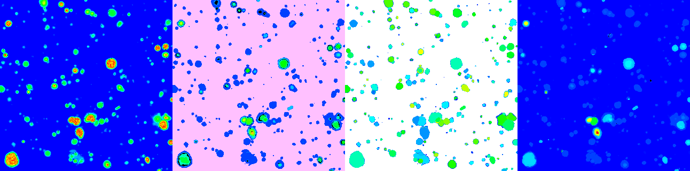

# Summary
The detection and classification of objects in astrophysical data has been a key task since the earliest days of astronomy. Over the past decade, the volume of newly observed data has increased dramatically. The advent of integral field unit spectrographs (IFUs), which produce 3D data cubes, has shifted the focus from classical single-target observations to much broader fields of view captured in a single exposure.
Simple flux-level peak detection algorithms based on thresholding are prone to either missing many potential real objects or, as a trade-off, producing an abundance of false positives.

The VLT/MUSE [@Bacon+10; @Bacon+14] 3D spectrograph creates $\sim$ 90,000 medium resolution spectra arranged in a 300 $\times$ 300 spatial grid.
These data cubes have typical sizes of 3-6 GiB per exposure, the sheer amount of data
asks for automated processes to support the scientists.

The *F*ind *E*mission *LINE*s tool ``FELINE`` combines a fully parallelized galaxy line template matching with the matched filter approach for individual emission features of LSDcat [@HerenzE_17a; @herenz2023].

The ``FELINE`` algorithm evaluates the likelihood of emission lines at specific positions in each spectrum of the data cube. It does this by probing all possible combinations of up to 14 typical emission features, including Hα, Hβ, Hγ, Hδ, [OII], [OIII], [NII], [SII], and [NeIII], for the redshift range of interest (0.4 < z < 1.4). This extensive analysis leads to approximately 230,400,000,000  iterations.

# Science field
The signal-to-noise cube generated after matched filtering with a 3D emission line template reflects the probability of an emission line at a given spatial and spectral position. This probability is significantly boosted by the filtering process.
As a result, galaxies with multiple weak emission features can be detected with a significance that substantially exceeds the significance of each individual contributing line.
This approach is particularly successful for galaxies that show no or little continuum flux in the data, and therefore would generally go undetected in imaging data alone.

``FELINE`` was used for the galaxy catalogs of the MEGAFLOW survey in [@Langan2023, @Cherrey2024, and @Schroetter2024].

# Implementation
The tool uses a brute-force search through the parameter space. Due to the size of the parameter space, the language of implementation was chosen as C for computational efficiency. This approach demonstrates the success of filtering the data with expected templates for individual emission lines, rather than testing full physical models of galaxies (including simulated continuum and temperature-broadened emission lines) against the raw observed data. This reduces the individual models to a single position at which the likelihood of a line is being probed.

For each set of parameters (spatial position in the cube, redshift, and line composition), the ``FELINE`` algorithm returns the value of the highest-scoring combination, along with its corresponding redshift and line composition.

The data cube contains 300 x 300 spectra, each of which is relatively small (< 64KB). The algorithm performs 512 x 5000 iterations on each spectrum, returning only 3 values: the quality of the best match, the redshift of the best match, and the line combination of the best match. Importantly, the outer 300 x 300 iterations are completely independent of each other.

To take advantage of this independence, the code utilizes full parallelization of the outer loop using ``OpenMP``, with most variables shared due to their independence. As a result, FELINE scales quite well with the number of CPU cores.
Runtimes for the ``FELINE`` code on the provided 2.8 GB example cube [@Bacon+22] (CC BY-NC-SA 4.0):

+-------------------+------------+--------------------+
| Device            | Cores      | Runtime in seconds |
|                   |            |                    |
+:=================:+:==========:+:==================:+
| AMD_EPYC_7542     |        1   |            1150    |
| AMD_EPYC_7542     |        4   |             282    |
| AMD_EPYC_7542     |        8   |             141    |
| AMD_EPYC_7542     |       16   |              71    |
+-------------------+------------+--------------------+
| NVIDIA A100 GPU   |       64   |              27    |
+-------------------+------------+--------------------+

Another major improvement in execution time was accomplished by re-arranging the data to maximize the amount of cache hits. Initially, the cube data is stored as a series of images, i.e., 300 x 300 spatial data points arranged in an array of 4,000 in spectral dimension. The algorithm works on spectral which would be strongly interleaved by  ~360 KB for consecutive data points and the full spectrum exceeding a range of 1 GiB.
As a preprocessing step, the data cube is re-arranged as a spatial grid of full spectra.

That arrangement further motivated an implementation of ``FELINE`` in ``CUDA`` to utilize GPUs for parallelization.
Typical full size MUSE data cubes can be fully loaded into the GPU memory of any modern ``CUDA`` capable GPU.
We provide a working implementation that produces identical results to the ``FELINE`` C variant.

Optionally, FELINE plots the three return parameters in real time via SDL surface along with storing them on disk.

Shown are from left to right the quality of the best match, the corresponding redshift of the best match and its template. A fourth panel shows the number of lines that contributed to the most successful model for ease of human readability (it reflects the number of set bits in the best model value).

We provide a python framework to further visualize and verify the ``FELINE`` detections.

# Acknowledgements

We acknowledge the work on LSDcat by Christian Herenz

# References

