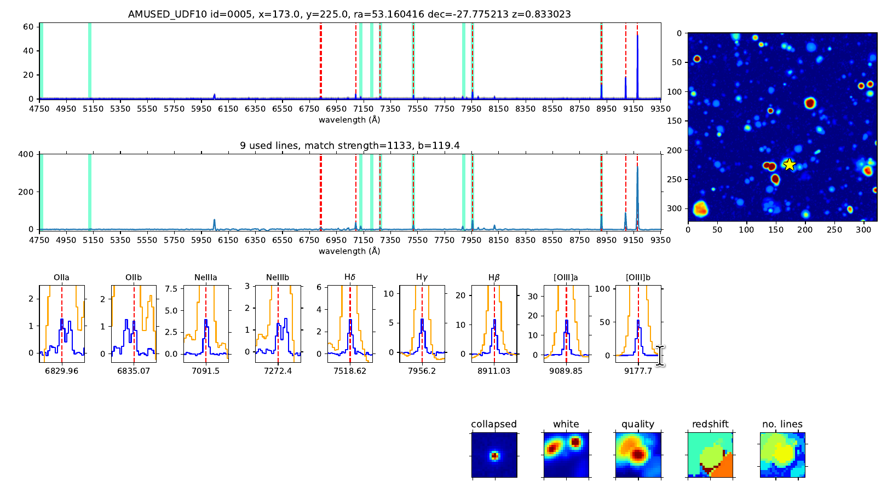

# Summary
The detection and classification of objects in astrophysical data has been a key task since the earliest days of astronomy. Over the past decade, the volume of newly observed data has increased dramatically. The advent of integral field unit spectrographs (IFUs), which produce 3D data cubes, has shifted the focus from classical single-target observations to much larger fields of view captured in a single exposure.
Simple flux level peak detection algorithms based on thresholding are prone to either missing many potential real objects or, as a trade-off, produce an abundance of false positives.

# Statement of need
The *F*ind *E*mission *LINE*s tool ``FELINE`` combines a fully parallelized galaxy line template matching with the matched filter approach for individual emission features of LSDcat [@HerenzE_17a; @herenz2023].
This transformation cross-correlates the dataset with a template that ideally matches the properties of the signal to be detected. Here, the images are cross-correlated with a 2D template for the expected light distribution of the sources to be detected and the same is applied in the spectral direction. The filter maximizes the signal-to-noise ratio (S/N) of a source that is optimally represented by the template while still producing a significant S/N enhancement for similar signals.

The VLT/MUSE [@Bacon+10] 3D spectrograph creates $\sim$ 90,000 medium-resolution spectra arranged in a 300 $\times$ 300 spatial grid.
These data cubes have typical sizes of 3-6 GiB per exposure, the sheer volume of data
requires automated processes to support the scientists.

The ``FELINE`` algorithm evaluates the likelihood of emission lines at specific positions in each spectrum of the data cube. It does this by probing all possible combinations of up to 14 typical emission features, including Hα, Hβ, Hγ, Hδ, [OII], [OIII], [NII], [SII], and [NeIII], for the redshift range of interest (0.4 < z < 1.4). This extensive analysis leads to approximately $2.3\cdot 10^{11}$  iterations.

There are generally two approaches to source identification. Image based, such as SExtractor [@Bertin1996] and its many
derivatives or emission line based, such as, the ORIGIN code [@Mary2020] or the previously mentioned LSDcat[@HerenzE_17a; @herenz2023].
The former group analyzes white or narrow band images and is prone to miss objects with minimal or no continuum flux.
On the other hand specialized software that focuses on detecting emission features is generally targeted at individual lines, like Lyman-$\alpha$. In contrast, the ``FELINE`` tool evaluates a physically connected set of emission lines simultaneously
and has been successfully tested as an automated identification system, providing rapid results for 3D data cubes that can be easily reviewed by humans.
In [@Bouche2024] we use a dual galaxy identification process based both on continuum (using SExtractor) and on
emission lines using FELINE. Overall, we find that up to one third of our detected galaxies have no continuum
detection within our magnitude limit.

# Science field
The signal-to-noise cube generated after matched filtering with a 3D emission line template reflects the probability of an emission line at a given spatial and spectral position,
which is significantly boosted by the filtering process.
As a result, galaxies with multiple weak emission features can be detected with a significance that exceeds the significance of each individual contributing line.
This approach is particularly successful for galaxies that show little or no continuum flux in the data, and therefore would generally go undetected in imaging data alone.

``FELINE`` was used for the galaxy catalogs of the MEGAFLOW survey in [@Langan2023; @Cherrey2024; @Schroetter2024; @Bouche2024].

# Implementation
The tool uses a brute-force search of the parameter space. Due to the size of the parameter space, the language of implementation was chosen as C for computational efficiency. This approach demonstrates the success of filtering the data with expected templates for individual emission lines, rather than testing full physical models of galaxies (including simulated continuum and temperature-broadened emission lines) against the raw observed data. This reduces the individual models to a single position where the likelihood of a line is being probed.

For each set of parameters (spatial position in the cube, redshift, and line composition), the ``FELINE`` algorithm returns the value of the highest-scoring combination, along with its corresponding redshift and line composition.

The data cube contains 300 x 300 spectra, each of which is relatively small (< 64KB). The algorithm performs 512 x 5000 iterations on each spectrum, returning only 3 values: the quality of the best match, the redshift of the best match, and the line combination of the best match. Importantly, the outer 300 x 300 iterations are completely independent of each other.

To take advantage of this independence, the code utilizes full parallelization of the outer loop using ``OpenMP``, with most variables shared due to their independence. As a result, FELINE scales quite well with the number of CPU cores.
Runtimes for the ``FELINE`` code on the provided 2.9 GB example cube [@Bacon+22] (CC BY-NC-SA 4.0):

+-------------------+------------+--------------------+
| Device            | Cores      | Runtime in seconds |
|                   |            |                    |
+:=================:+:==========:+:==================:+
| AMD_EPYC_7542     |        1   |            1150    |
| AMD_EPYC_7542     |        4   |             282    |
| AMD_EPYC_7542     |        8   |             141    |
| AMD_EPYC_7542     |       16   |              71    |
+-------------------+------------+--------------------+
| NVIDIA A100 GPU   |       64   |              27    |
+-------------------+------------+--------------------+

Another major improvement in execution time was accomplished by rearranging the data to maximize the number of cache hits. Initially, the cube data is stored as a series of images, i.e., 300 x 300 spatial data points arranged in an array of 4,000 in spectral dimension. 
The spectral data the algorithm works on is highly interleaved by ~360 KB for consecutive data points. A single spectrum is spread over more than 1 GiB in the original data.
As a preprocessing step, the cube data is therefor rearranged as a spatial grid of full spectra. 

This arrangement further motivated an implementation of ``FELINE`` in ``CUDA`` to utilize GPUs for parallelization.
Typical full size MUSE data cubes can be fully loaded into the GPU memory of any modern ``CUDA``-enabled GPU.
We provide a working implementation that produces identical results to the ``FELINE`` C variant.

Optionally, FELINE plots the return parameters in real time via SDL_Surface and also saves them to disk
(see Figure 1).

Shown in Figure 1 from left to right are the quality of the best match, the corresponding template integer of the best match and its redshift. The fourth panel shows the number of lines that contributed to the most successful model for ease of human readability (it reflects the number of set bits in the best model value). 

We also provide a simple Python framework for further visualization and manual verification of the FELINE detections (see Figure 2).

# Acknowledgements

We acknowledge the work on LSDcat by Christian Herenz, as well as the helpful MUSE Python Data Analysis Framework MPDAF for visualisation [@Bacon16].

# References

